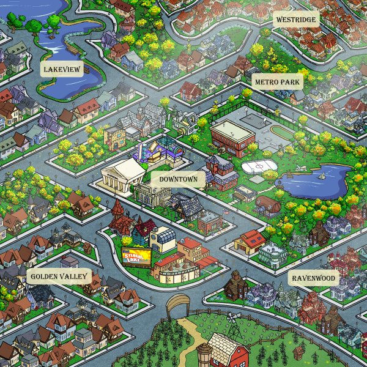
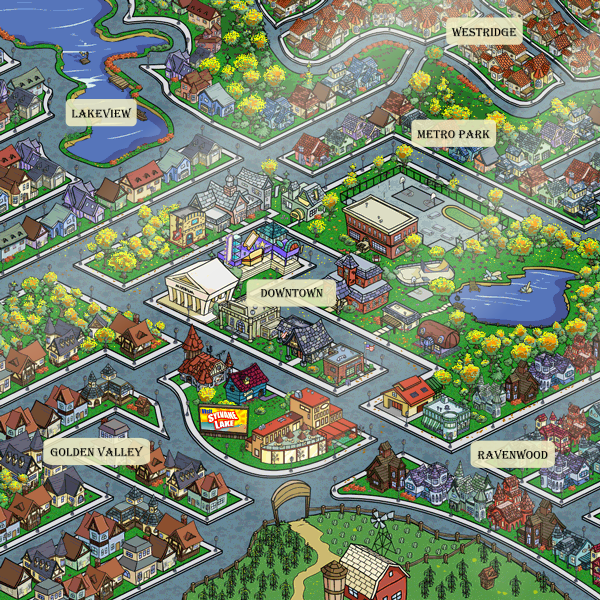
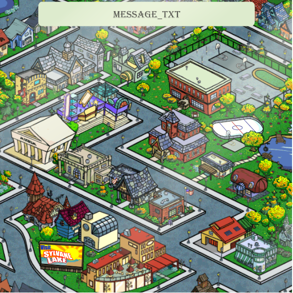
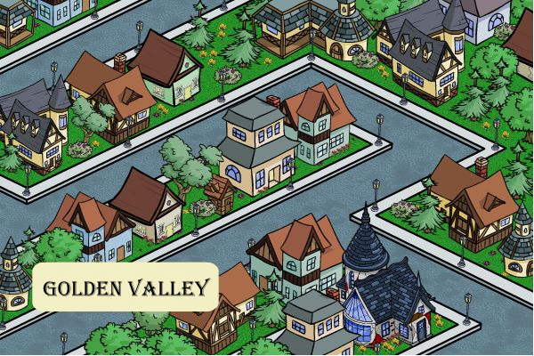
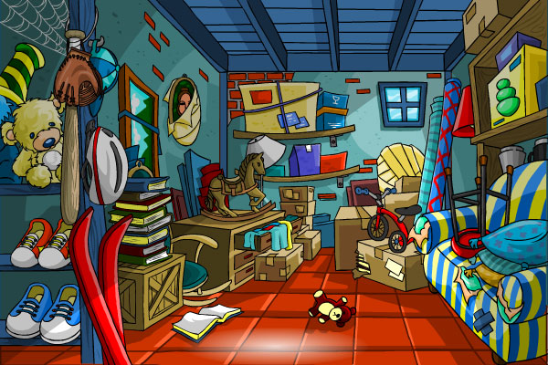
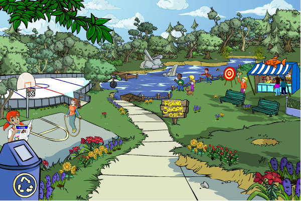
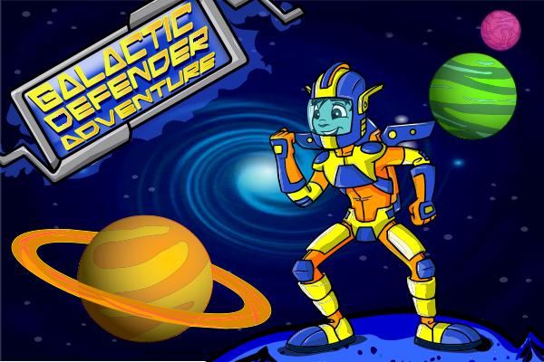
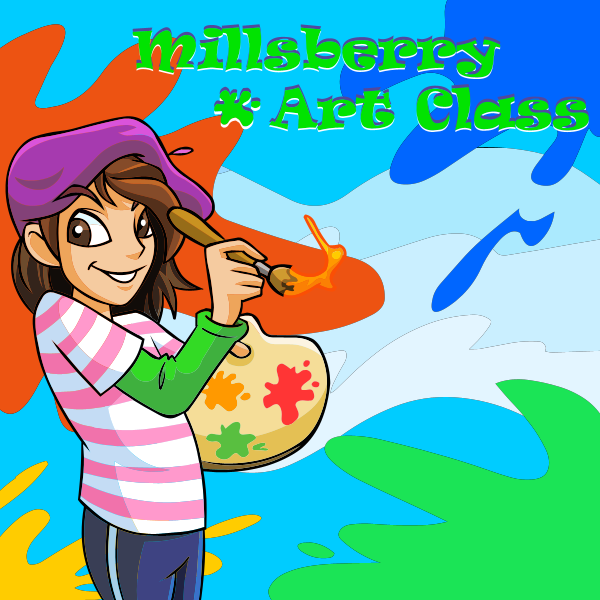
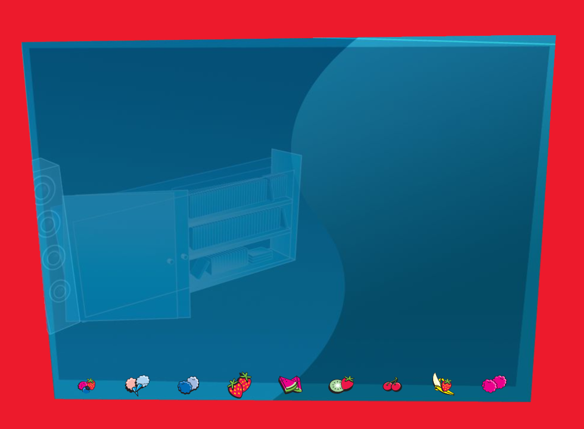

# Millsberry Replay Archive

This repository preserves a recovered Millsberry replay stack, the supporting recovery notes, and the archived assets used to replay the site locally and on the public demo at `https://millsberry.markshaw.ca`.

## What Is Here

- `app/` - the replay server, Docker packaging, and local runtime assets.
- `official-core-recovered/`, `official-recovered/`, `official-recovered-assets/`, `official-full-backup/` - the recovered official source trees.
- `recovery-osint/` - route inventories, missing-asset reports, and recovery notes.
- `recovery-tools/` - tooling used during recovery.
- `another-user-backup-attempt/` - earlier backup material that is kept separate from the current recovery track.

## Public Demo

- URL: `https://millsberry.markshaw.ca`
- Demo login: `testcitizen` / `millsberry`

The public site is proxied through Apache to a localhost-only Node service so the replay backend is not directly exposed.

## Status

The replay is usable, but some recovered content is still incomplete. The best summary of what works and what is missing lives in `app/STATUS.md` and `app/ARCADE_RECOVERY.md`.

## Contributing

Pull requests that improve recovery coverage, verify missing assets, tighten route reconstruction, or improve documentation are welcome.

Before opening a PR, please read `CONTRIBUTING.md` and check `recovery-osint/missing-requests.jsonl` or `app/output/missing-requests.jsonl` for the highest-value gaps.

## Gallery

First-frame teaser photos extracted from recovered SWFs. The full interactive gallery (669 images, filterable and searchable) is at [`/swf-teasers`](https://millsberry.markshaw.ca/swf-teasers) on the live demo.

<table>
<tr>
<td align="center"> Main Town Map (v30)</td>
<td align="center"> Main Town Map — Fall Season</td>
<td align="center"> Downtown Map (v31)</td>
</tr>
<tr>
<td align="center"> Golden Valley</td>
<td align="center"> Basement</td>
<td align="center"> Peabody Park</td>
</tr>
<tr>
<td align="center"> Galactic Swirl Defender (interior)</td>
<td align="center"> Museum</td>
<td align="center"> Contest Page</td>
</tr>
</table>
